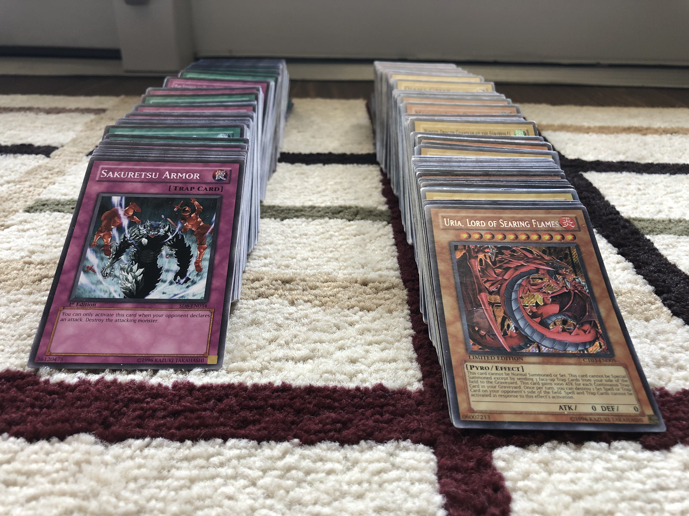

# Yu-Gi-Oh! Card Collection
When I was 11 years old and knew nothing of the value of money, I bought Yu-Gi-Oh! card tins every 2 weeks after I had 
saved enough with mowing money. Over the course of several months I had purchased all available tins that summer - 
amassing a collection of 704 cards, which was a lot for someone that doesn't think of themselves as an avid 
card collector. Several years passed as I completed high school and college, having forgotten about the cards 
somewhere along the way. 


Recently I found the cards again while rummaging through my old belongings and thought it would be fun to 
make a digital library with them. 




## Installation
This application was written using **Python 3.6**.

Following best practices, it is recommended to set up a python virtual environment.
Use pip to install all packages included in _requirements.txt_. 
```
pip install -r requirements.txt
```


## Development Phases
This project was broken into 3 phases of development: 
Importer, Syncronizer, and CLI application.
### Phase 1 - Data Importer


|name|race_type|attribute|level|attack|defense|edition|set_number|pass_code|condition|
|---|---|---|---|---|---|---|---|---|---|
|"Hamon, Lord of Striking Thunder"|Thunder / Effect|Light|10|4000|4000|LE|CT03-EN006|32491822|LP|
|Spiral Serpant|Sea Serpent|Water|8|2900|2900| |STON-EN003|32626733|LP|
|Kuriboh|Fiend / Effect|Dark|1|300|200| |SYE-019|40640057|D|
|Black Luster Soldier|Warrior / Ritual|Earth|8|3000|2500| |SYE-024| |LP|
|Dark Paladin|Spellcaster / Fushion / Effect|Dark|8|2900|2400|LE|DMG-001|98502113|LP|
|Dark Magician|Spellcaster|Dark|7|2500|2100| |SYE-001|46986414|LP|
|Cyberdark Dragon|Machine / Fusion / Effect|Dark|8|1000|1000|FE|CDIP-EN035|40418351|NM|

### Phase 2 - Data Syncronizer

### Phase 3 - CLI Application